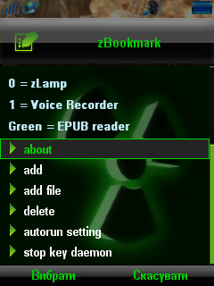

keyd
====

Simple daemon skeleton for monitoring buttons on MotoMAGX phones with vibration haptics functionality and config reading.



For example, [zBookmark](http://forum.motofan.ru/index.php?s=&showtopic=165931&view=findpost&p=1783994) application by VINRARUS for Motorola ZN5 based on keyd.

## Download

You can download TAR.GZ-package with executables for MotoMAGX from the [releases](https://github.com/EXL/keyd/releases) section.

## Build instructions

For example, GNU/Linux:

* Install the latest [Toolchain’s & SDK for MotoMAGX](http://exlmoto.ru/toolchains-sdk-for-motomagx/);

* Clone repository into deploy directory;

```sh
cd ~/Deploy/
git clone https://github.com/EXL/keyd keydMAGX
```

* Build the TAR.GZ-package into deploy directory;

```sh
cd ~/Deploy/keydMAGX/
./package.sh
```

## More information

Please read [Making Guide (In Russian)](http://exlmoto.ru/new-updates-and-tools#2) for more info about making keyd for MotoMAGX.
